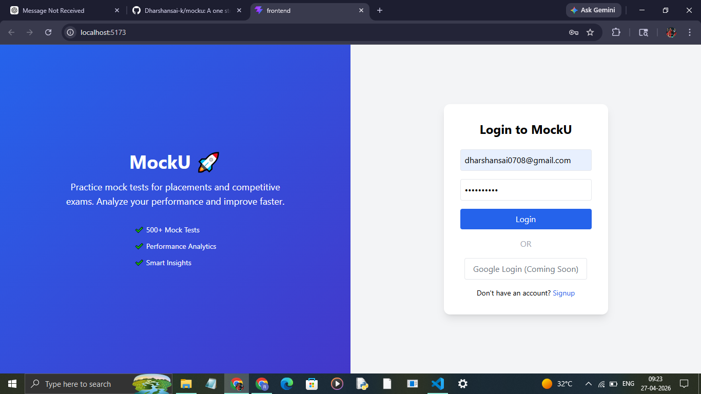
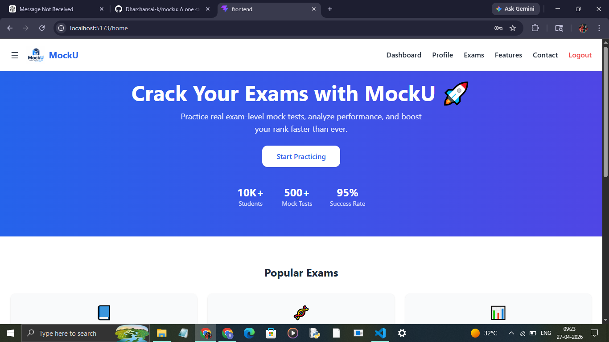
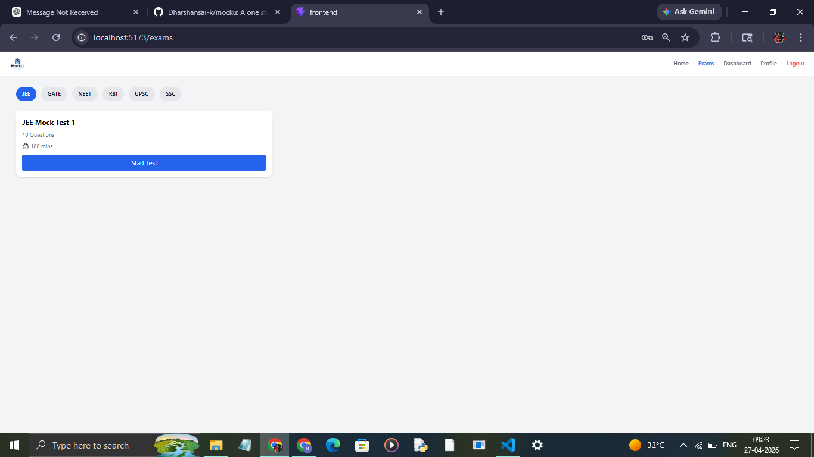
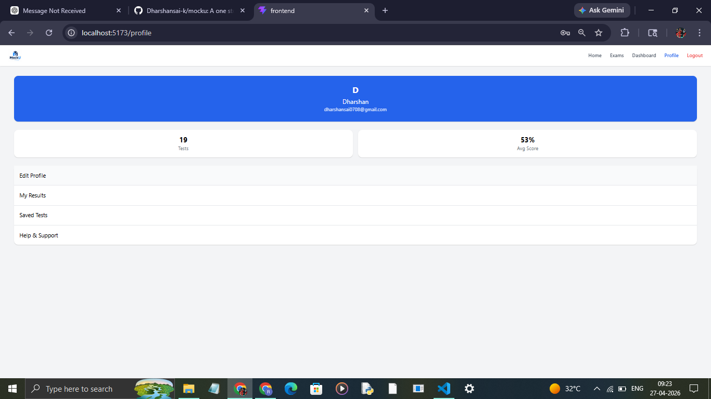
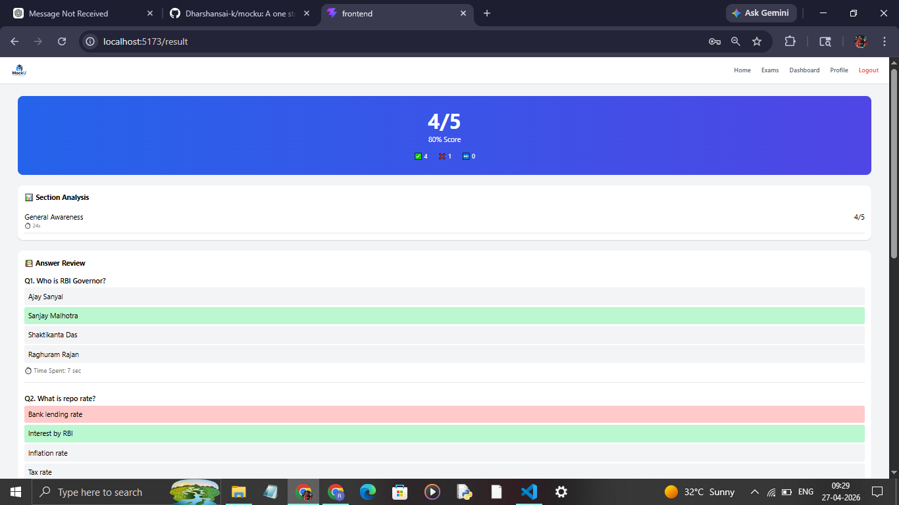
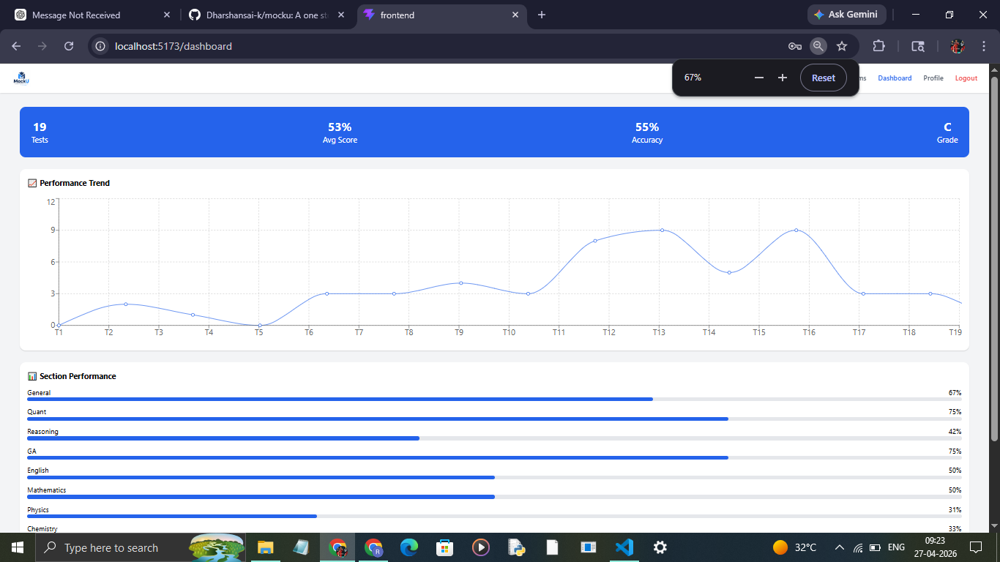

# MockU 🚀

AI-based mock test platform for competitive exams like JEE, SSC, GATE, etc.

## ✨ Features
- Real-time exam simulation
- Section-wise performance analysis
- Time tracking per question
- Dashboard with insights

## 🛠 Tech Stack
- React.js
- Node.js
- Express
- MongoDB

## 📸 Screenshots

### 📊 Login Page

### 🏠 Home Page

### 🧪 Test Interface

### 📊 Profile Page

### 📊 Result Page

### 📈 Dashboard

## 🚀 Run Locally

### Backend
cd backend
npm install
npm run dev

### Frontend
cd frontend
npm install
npm run dev